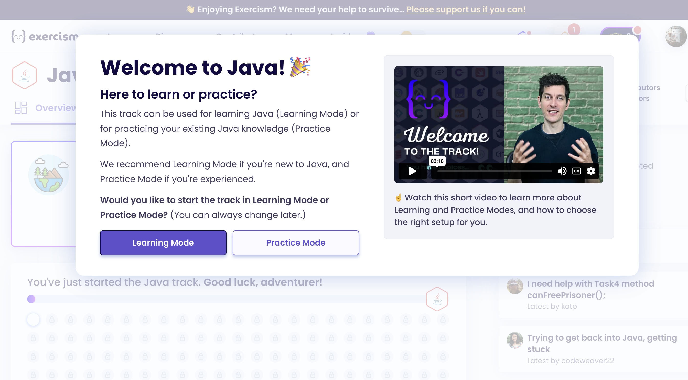

# Assignment

[Exercism](https://github.com/exercism/java)
  

### Write about your dream project

- A rough sketch on what you would like to work on. By sketch i mean writing what you would like your project to be
    - it includes project scope and objectives
    - what milestones you think might be there
- what things you suspect you might need.
    - programming language, technologies you might need to learn
- How will you start doing your due dilligence
    - How you would research on the topic
        - identifying what things you lack on 
        - diving deeper into your initial research 
        - trying to build the specification for your project 
    - How you will learn the required technologies (maybe youtube video/ maybe github repo/ maybe blog post/ maybe book)
- Initial Project schedule
- how will you maintain quality and make sure your requirements are met. Maybe passing smoke test, end to end test  
    - how you define them

### Assignment format

# Project-Oriented Approach Assignment

## Part 1: Project Sketch

### A. Project Scope and Objectives
- **Question**: Write a detailed sketch of what you would like your project to be. Include the following:
  - What is the overall goal of your project?
  - What specific objectives do you aim to achieve?

### B. Milestones
- **Question**: Identify and list the key milestones you think might be there for your project. What major steps will you need to complete to achieve your objectives?

## Part 2: Requirements and Resources

### A. Required Resources
- **Question**: What things do you suspect you might need for your project? 
  - Consider the programming languages and technologies you might need to learn or use.
  - List any specific tools or resources you anticipate needing.

## Part 3: Due Diligence

### A. Research Approach
- **Question**: How will you start doing your due diligence on the topic of your project? Include:
  - How you will identify the gaps in your knowledge.
  - How you will dive deeper into your initial research.
  - How you will build the specifications for your project.

### B. Learning Plan
- **Question**: How will you learn the required technologies for your project? 
  - Will you use YouTube videos, GitHub repositories, blog posts, or books? 
  - Provide a brief plan on how you will acquire the necessary skills.

## Part 4: Project Schedule

### A. Initial Schedule
- **Question**: Develop an initial project schedule. 
  - Outline the timeline for completing each major task or milestone. 
  - Specify any important deadlines or phases in your project.

## Part 5: Quality Assurance

### A. Quality Maintenance
- **Question**: How will you maintain quality and ensure that your project requirements are met?
  - Discuss your approach to defining and conducting tests (e.g., smoke tests, end-to-end tests).
  - How will you ensure your project meets the specifications and standards you have set?

---

Please answer each question in detail, providing as much information as possible to outline your approach to your project. This assignment aims to help you plan and execute your project effectively, ensuring all critical aspects are considered and addressed.

