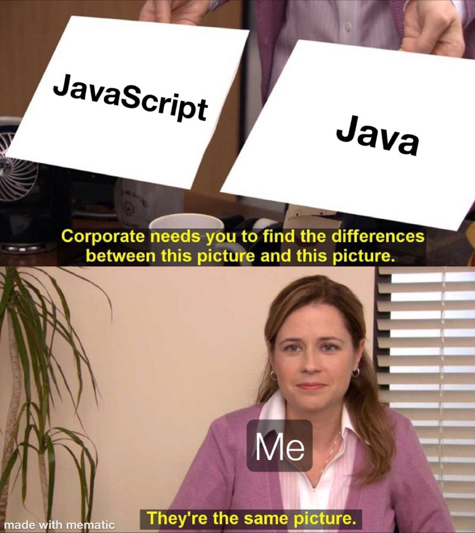
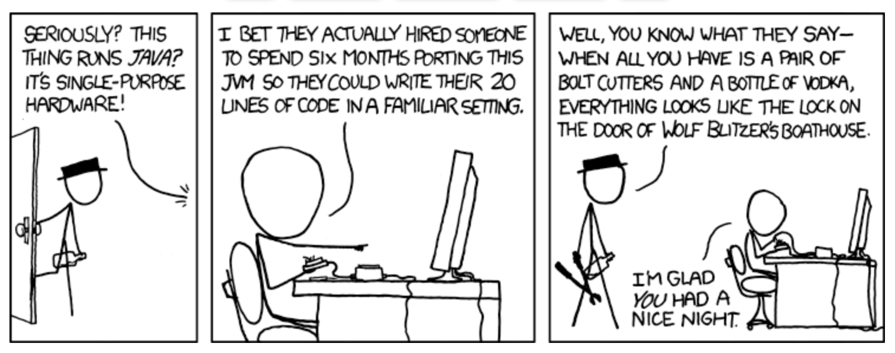

# Introduction to Java

## History of Java

### The Past

Java was developed by Sun Microsystems in the mid-1990s by James Gosling and his team. Initially, it was called Oak, but later it was renamed Java. The language was designed with the principle of "write once, run anywhere" (WORA), meaning that compiled Java code can run on any platform that supports Java without the need for recompilation. This cross-platform capability has been one of Java's greatest strengths.

### Early Milestones

- **1995**: Java 1.0 (Oak) released.
- **1996**: Java 1.1 introduced inner classes, JavaBeans, JDBC, and RMI.
- **1997**: Java 1.2 (Java 2) introduced the Swing graphical API, Collections Framework, and JIT compiler.

## The Present

Java has evolved significantly over the years, becoming one of the most popular programming languages. It is widely used in various domains, including web development, mobile applications (Android), enterprise applications, scientific computing, and more. Java's ecosystem includes a vast array of libraries, frameworks, and tools that support modern software development practices.

### Key Features of Java

1. **Platform Independence**: Java's bytecode can run on any system with a compatible JVM.
2. **Object-Oriented**: Java promotes modular, reusable, and scalable code through object-oriented principles.
3. **Robust and Secure**: Java has strong memory management, exception handling, and security features.
4. **Multi-threaded**: Java supports concurrent programming with built-in threading capabilities.
5. **Rich API**: Java provides a comprehensive standard library for various tasks, from data structures to networking.
6. **Automatic Memory Management**: Java's garbage collector handles memory allocation and deallocation.
7. **Dynamic**: Java supports dynamic loading of classes, allowing for flexible and adaptive applications.

### Notable Versions and Features

#### Java SE 5 (2004)

- **Generics**: Enhanced type safety by allowing classes, interfaces, and methods to operate on types specified at compile time.
- **Enhanced for-loop**: Simplified iteration over collections and arrays.
- **Autoboxing/Unboxing**: Automatic conversion between primitive types and their corresponding wrapper classes.
- **Annotations**: Metadata added to Java source code to provide additional information to the compiler.
- **Concurrency utilities**: New java.util.concurrent package for multi-threaded programming.

#### Java SE 6 (2006)

- **Scripting API**: Integrated support for scripting languages.
- **Improvements to Web Services**: Better support for web services with JAX-WS.
- **Compiler API**: Java Compiler API in javax.tools package.
- **Enhanced monitoring and management capabilities**: Improved JMX, JVM monitoring, and diagnostics.

#### Java SE 7 (2011)

- **Project Coin**: Small language changes like try-with-resources, multi-catch exceptions, and diamond operator.
- **Fork/Join Framework**: Simplified parallel processing by breaking tasks into smaller pieces.
- **NIO.2**: Enhanced filesystem and I/O capabilities.
- **InvokeDynamic**: Improved support for dynamic languages on the JVM.

#### Java SE 8 (2014)

- **Lambda Expressions**: Introduced functional programming capabilities.
- **Streams API**: Enabled functional-style operations on collections.
- **Optional**: A container object to handle potentially null values without NullPointerException.
- **Date and Time API**: A new modern date and time API in java.time package.
- **Default Methods**: Methods with default implementations in interfaces.

#### Java SE 9 (2017)

- **Project Jigsaw**: Module system for better packaging and dependency management.
- **JShell**: Interactive REPL (Read-Eval-Print Loop) tool.
- **Improved JIT Compiler**: Introduction of the experimental JIT compiler, Graal.
- **Enhanced Stream API**: Added methods for better stream operations.

#### Java SE 10 (2018)

- **Local-Variable Type Inference**: Introduction of var for local variables.
- **Application Class-Data Sharing**: Reduced startup and footprint for applications.
- **Parallel Full GC for G1**: Improved garbage collection performance.

#### Java SE 11 (2018)

- **LTS (Long-Term Support)**: Java 11 is a long-term support release.
- **HTTP Client**: Standardized HTTP client API.
- **Nest-Based Access Control**: Simplified access control for nested classes.
- **Removed Features**: Removed deprecated features like Java EE and CORBA modules.

#### Java SE 12 (2019)

- **Switch Expressions (Preview)**: Enhanced switch statements for simpler and more readable code.
- **JVM Constants API**: New API to model key class-file and runtime artifacts.

#### Java SE 13 (2019)

- **Text Blocks (Preview)**: Multiline string literals for better readability.
- **Reimplemented the Legacy Socket API**: Improved performance and scalability.

#### Java SE 14 (2020)

- **Switch Expressions**: Finalized switch expressions feature.
- **Pattern Matching for instanceof (Preview)**: Simplified type checks.
- **Records (Preview)**: Simplified data classes.

#### Java SE 15 (2020)

- **Text Blocks**: Finalized text blocks feature.
- **Hidden Classes**: Improved framework creation and execution.

#### Java SE 16 (2021)

- **Pattern Matching for instanceof**: Finalized pattern matching for instanceof.
- **Records**: Finalized records feature.
- **Sealed Classes (Preview)**: Restricted class hierarchies for better inheritance control.

#### Java SE 17 (2021)

- **LTS (Long-Term Support)**: Java 17 is a long-term support release.
- **Sealed Classes**: Finalized sealed classes feature.
- **New macOS Rendering Pipeline**: Improved macOS support.

---

## The Future of Java

### Continuous Evolution

Java continues to evolve with regular releases every six months, ensuring timely updates and new features. This rapid release cadence allows the Java community to adopt new features and improvements more quickly.

### Focus Areas

1. **Performance**: Ongoing enhancements in JVM performance, including improvements in garbage collection and Just-In-Time (JIT) compilation.
2. **Language Enhancements**: Continued introduction of language features that improve developer productivity and code readability, such as pattern matching and records.
3. **Platform Support**: Better support for new platforms and environments, including cloud-native development and containerization.
4. **Security**: Strengthening security features to protect applications from evolving threats.
5. **Tooling**: Improved development tools and integration with modern development environments and CI/CD pipelines.

### Upcoming Features

- **Project Loom**: Introducing lightweight concurrency constructs (fibers) for scalable applications.
- **Project Panama**: Enhancing the connection between Java and native code for better performance and interop.
- **Project Valhalla**: Introducing value types to improve memory efficiency and performance.

---

