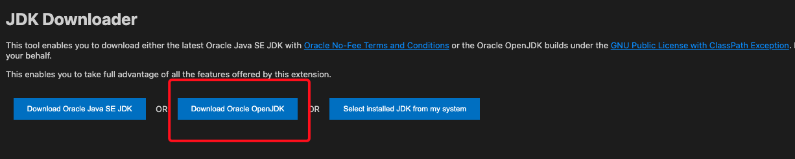
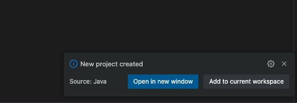

---

# Setting Up Visual Studio Code for Java Development

## Prerequisites

1. Visual Studio Code installed from the [official website](https://code.visualstudio.com/).
2. Java Development Kit (JDK) installed (as detailed in the previous sections).

---

## Step 1: Install Java Extensions in VSCode

### 1. Open Visual Studio Code

### 2. Go to Extensions View

- Click on the Extensions icon in the Activity Bar on the side of the window.
- Alternatively, you can open the Extensions view by pressing `Ctrl+Shift+X` (Windows/Linux) or `Cmd+Shift+X` (Mac).

### 3. Install Java Extension by Oracle 


- In the Extensions view, search for "Java".
- Click on the install button for the "Java" by Oracle.

The Java Extension Pack includes the following essential extensions for Java development:
- Language Support for Java(TM)
- Debugger for Java
- Java Test Runner
- Maven for Java
- Gradle for Java
- Java Dependency Viewer
- Visual Studio IntelliCode

### 4. Additional Recommended Extensions (Optional)

- **SonarLint**: Provides real-time feedback on code quality.
- **Spring Boot Extension Pack**: If you are developing Spring Boot applications.

---

## Step 2: Configure Java in VSCode

- Open the command palette `Ctrl+Shift+P`
- Type `Download, install and use JDK` 



- Select your Operating System and then let it download.
- After installation it will ask to restart 


## Step 3: Create and Run a Java Project

### 1. Create a New Java Project

- Open the Command Palette by pressing `Ctrl+Shift+P` (Windows/Linux) or `Cmd+Shift+P` (Mac).
- Type `Java: Create Java Project` and select it.
- select `Maven` or `Gradle` for a more complex project.
- specify your project directory
- specify your project package name 



### 3. Write Your Java Code

Open `Something.java` and write a simple Java program:

```java
public class Main {
    public static void main(String[] args) {
        System.out.println("Hello, World!");
    }
}
```


